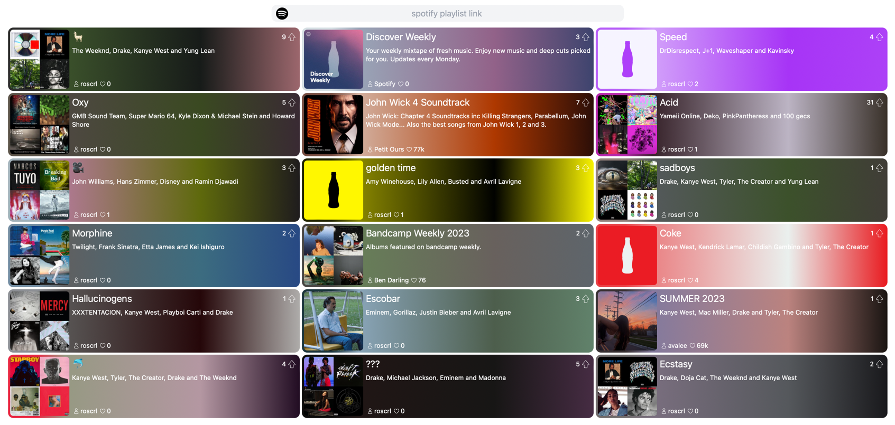

# [playlistvote.com](www.playlistvote.com)

spotify playlist voting<br>



## Setup

See [Makefile](Makefile) for details

`make tools`

`make hotreload-mock`

`make hotreload`

## Dependencies

### Frontend

Server side rendered Go templates with `html/template`

`tailwindcss` styling

`hotwire/turbo` for frontend JS, vendored

`alpinejs` for frontend JS, vendored

### Production

`go-sqlite3` for database driver, requires `zig cc` to compile x86 from ARM

`sqlc` for Go code generation from [SQL queries](db/query.sql)

`prominentcolor` for prominent playlist image colors

`newrelic/go-agent` for monitoring

### Development

`is` for assertions

`fsnotify` for watching Go template changes for dev mode without recompiling

#### Browser Tests

`node/npm` requires [.node](browsertests/.node-version)

`make test-browser`

`playwright` for browser automation

## Deploy

[VPS](https://specbranch.com/posts/one-big-server/) with Caddy, New Relic Agent, and a SQLite database.

#### VPS Setup Script (Debian)

```bash
# Caddy
sudo apt-get update && sudo apt install -y debian-keyring debian-archive-keyring apt-transport-https &&
curl -1sLf 'https://dl.cloudsmith.io/public/caddy/stable/gpg.key' | sudo gpg --dearmor -o /usr/share/keyrings/caddy-stable-archive-keyring.gpg &&
curl -1sLf 'https://dl.cloudsmith.io/public/caddy/stable/debian.deb.txt' | sudo tee /etc/apt/sources.list.d/caddy-stable.list &&
sudo apt update &&
sudo apt install caddy &&

# SQLite
sudo apt install sqlite3
```

```bash
# New Relic
curl -Ls https://download.newrelic.com/install/newrelic-cli/scripts/install.sh | bash && sudo NEW_RELIC_API_KEY=<KEY_HERE> NEW_RELIC_ACCOUNT_ID=<ACC_ID_HERE> /usr/local/bin/newrelic install &&
```

`make caddy-service-reload` [Caddy Systemd Service](config/caddy.service)

`make caddy-reload` [Caddyfile](config/caddy/Caddyfile)

### Cloudflare

SSL Full  
DNS A Record set to VPS IP

## Misc

#### Structure Inspiration

[Mat Ryer - How I write HTTP services after eight years talk](https://www.youtube.com/watch?v=XGVZ0Ip4XPM)  
[Mat Ryer - Deep dive of real application](https://www.youtube.com/watch?v=VRZZeJwIAIM)  
[Mat Ryer - Twitter thread](https://twitter.com/matryer/status/1445013230858952705?lang=en-GB)
